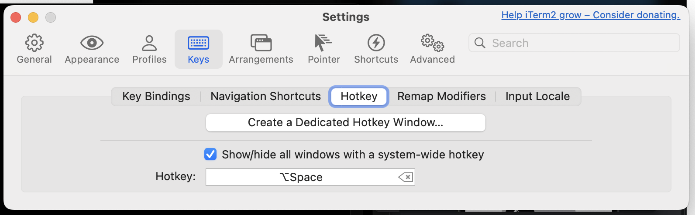
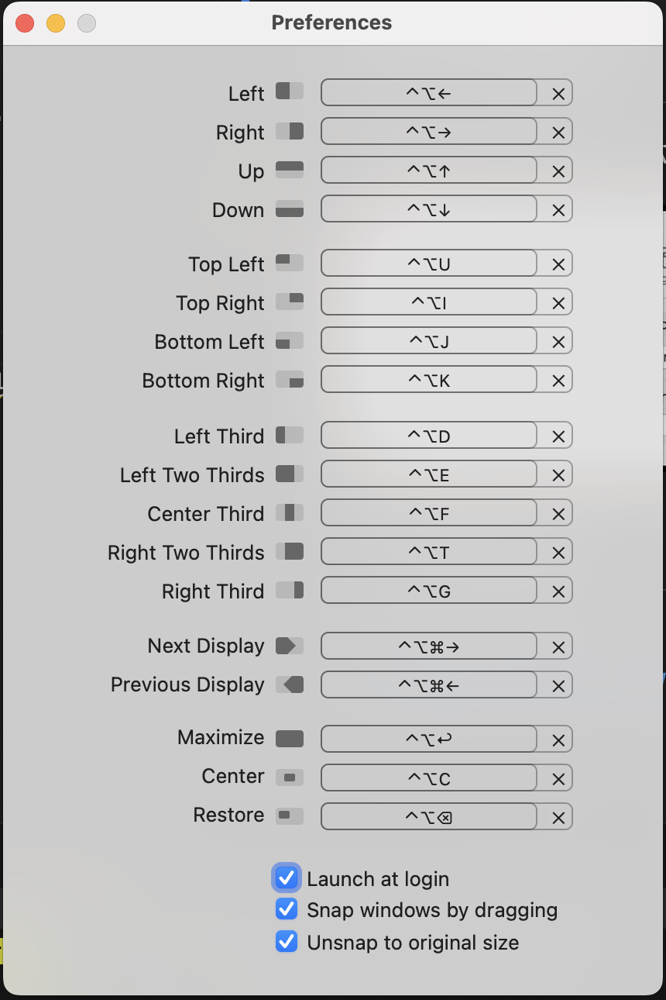

# Manual Settings

## Iterm2 Settings

Set *Hotkey Window* to '⌃⌥ + space' (Ctrl+Cmd+Space). See below.



## Install Magnet

Install Magnet and set it to launch at login.
[App store link.](https://apps.apple.com/us/app/magnet/id441258766?mt=12)



## Force the new *.zshrc* to take effect

Run this command after running the *shell-setup.sh* to force the new *.zshrc* to take effect immediately.

```bash
    source ~/.zshrc 
```

## Configure or reconfigure Powerlevel10k Theme

The *Powerlevel10k* theme can be configured by running the following command.

```bash
    p10k configure
```

disabling Powerlevel10k configuration
wizard, type the following command.

```bash
    echo 'POWERLEVEL9K_DISABLE_CONFIGURATION_WIZARD=true' >>! ~/.zshrc
```
